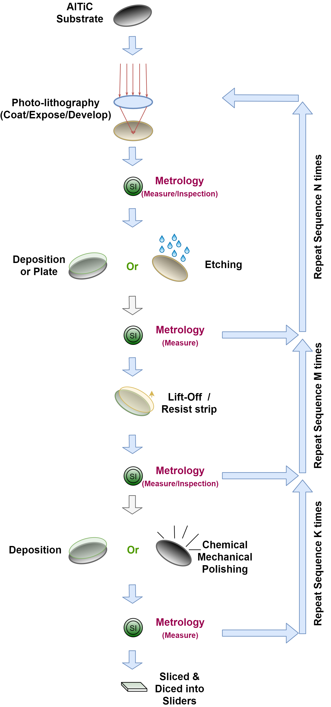
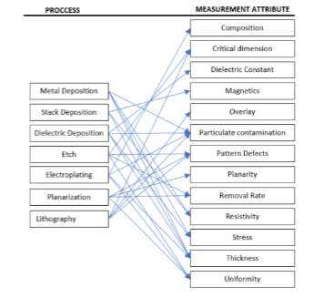
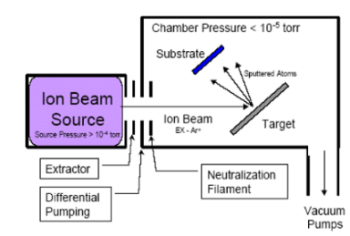

# Seagate Soft Sensing Data sets

These data sets are queried from Seagate wafer manufacturing data lake. The factories manufactures AlTiC substrates and cut into sliders for assembly of hard drives. A high-level manufacturing process is shown below. 

During the manufacturing, there are many different process stages as well as many measurements, the main processes and measurements are listed below:

  
The main processes steps involve deposition of metal layers and dielectric/insulating materials.  The deposition process  consists of depositing a material on the wafer through several technologies: PVD (Physical Vapor Deposition), PECVD (Plasma Enhanced Chemical Vapor Deposition), SACVD (Sub-Atmospheric Chemical Vapor Deposition), LPCVD (Low Pressure Chemical Vapor Deposition) or more recently ALD (Atomic Layer Deposition).

Milling/etching processes are performed to form critical structure of a wafer build. 

Electroplating is a common method for depositing thick layers of metal onto a surface. Planarization is the combined process for smoothing the wafer surface by chemically softening the surface followed by a removal of the softened material using mechanical abrasive action.

Photo lithography is patterning process that uses light to transfer a pattern from a photo mark to a light-sensitive thick film of chemical on the wafer. The pattern is then developed and the resulting images are then plated, etched or milled to produce 3-dimensional structures.

These processes are highly complex and sensitive to process and tool variations. A significant amount of engineering and systems resources are employed to monitor and control the variability that are intrinsic to complex systems of machines and people.

Metrology serves a critical function of managing these complexities for process development, early learning cycles and quality control. This, however, comes at high capital costs, increased cycle time and considerable overhead to set up correct recipes for measurements, appropriate process control and workflow mechanisms.

A typical process tool is illustrated below. It's a vacuum tool that deposits thin film metal.  Processes on this tool include both etching and deposition steps. Materials 	sputtered from the target deposits on the substrate to create a film.  In combination with the substrate fixture that rotates and changes the angle, this type of tooling system also delivers a broad range of control over sidewall coatings, trench filling and liftoff profiles. 

  
Details about each data set are described below, as well as in the these publications:

[paper links to be added]

## 1. sensor_data

In this folder, we queried and processed data from Seagate manufacturing factories in both Minnesota and Ireland. 
one year’s worth of process sensor data was covered, with the corresponding
measurement variables. The sampling rate of the sensors is mostly per second. The measurement data is
collected as a wafer is physically measured which could range from minutes to hours.

The process tool is a vacuum tool that deposits thin film metal. Processes on this tool include etching and deposition steps. 
Materials are sputtered from the target deposits on the substrate to create a film. 
In combination with the substrate fixture that rotates and changes the angle, this
type of tooling system also delivers a broad range of control
over sidewall coatings, trench filling and liftoff profiles.

The critical parameters measured for this family of tools are
magnetics, thickness, composition, resistivity, density, and
roughness. These parameters are critical to the quality of the
wafers and are measured by a family of high precision
measurement equipment that come high capital costs. A wafer can go through one or more measurement
tools, dependent on the criticality and complexity of the process
that needs to be measured. The sample size of measurement
variables are much lower than process variables. 

The data is saved as csv format, with necessary anonymization: the headers are renamed, the values are scaled, and categorical variables are encoded.

## 2. time-series-1
In this folder, the data sets contain high dimensional time-series sensor data coming from different manufacturing machines, that covers about 90 weeks, the physical manufacturing tools are the same as 'sensor_data' above.

In each processing stage, there are hundreds of sensors mounted in the processing machines to monitor the condition of the wafer under processing. These sensors collect information every few seconds and all these sensing values are collected and stored along with the measurement results. 

Given there are many-to-many mapping between processes and measurements in each stage, one time-series of sensor data are mapped to several measurements. On the other hand, some of measurements are linked to multiple processing stages. 

Each measurement contains a few numerical values to indicate the condition of the wafers, and a decision of pass or fail is made based on these numbers. For the sake of simplicity, we only cover the pass/fail information for each measurement. So that each sample of time-series sensor data are mapped to several binary classification labels.

There are 5 npy files, 3 of them are input files for train/val/test, and rest 2 are output labels for train/val. 
The output labels are hidden(will release in Nov 2021).

Input structure: the inputs are three dimensional data with structure [sample, time-step, feature]. 
Each sample is mapped to a row in the output labels
There are two kinds of features, float and integer, and the last feature is padding indicator (if the value is 1, this time-step is a padding)
Float features are scaled numerical features (column 727-815), and binary features are one-hot encoded categorical features (column 0-726)
The time-series are very short, you can manipulate it as you wish for the final prediction

Output structure: the output labels are two dimensional data with structure [sample, label]
The output contains several binary classification tasks, each task has two columns, eg. [task_0_negative, task_0_positive, task_1_negative, task_1_positive...]
For each pair of the columns, the values could be positive (0,1), negative (1,0), and missing (0,0)

## 3. time-series-2
Time-series-2 data set is for another tool family. These two tool families are just slightly different and the data queried are in the same format and in the same timeframe.

## 4. time-series-3
Time-series-3 data set is for another tool family. It's a little different from the above two tool families, and the data queried are in the same format and in the same timeframe. While the above two data sets come with a time-series length of 2, this data set only has 1 time step for each sample.

